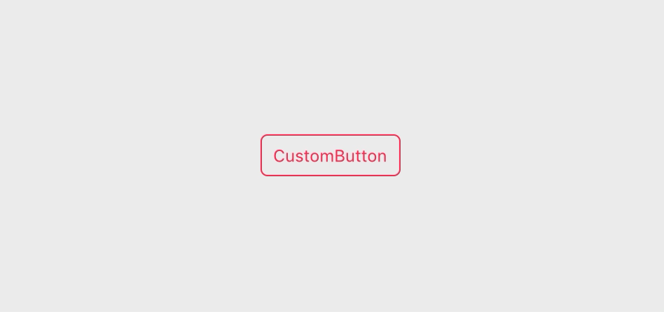

# CustomButton

> Customizable button for your macOS app



It's a layer-based NSButton subclass that animates the styles and colors between normal and active (pressed) state.

This package is used in production by [Gifski](https://github.com/sindresorhus/Gifski).

## Requirements

- macOS 10.12+
- Xcode 11.4+
- Swift 5.2+

## Install

Add `https://github.com/sindresorhus/CustomButton` in the [“Swift Package Manager” tab in Xcode](https://developer.apple.com/documentation/xcode/adding_package_dependencies_to_your_app).

## Usage

See the [source](Sources/CustomButton/CustomButton.swift) for what properties you can change and play with it in the [example app](Example). By default, it has no style.

```swift
import Cocoa
import CustomButton

@NSApplicationMain
class AppDelegate: NSObject, NSApplicationDelegate {
	@IBOutlet weak var window: NSWindow!

	func applicationDidFinishLaunching(_ notification: Notification) {
		let button = CustomButton()
		button.translatesAutoresizingMaskIntoConstraints = false
		button.title = "CustomButton"
		button.activeBackgroundColor = .systemPink
		button.borderWidth = 1
		button.borderColor = .systemPink
		button.cornerRadius = 5
		button.textColor = .systemPink
		button.activeTextColor = .white

		let contentView = window.contentView!
		contentView.addSubview(button)

		NSLayoutConstraint.activate([
			button.centerXAnchor.constraint(equalTo: contentView.centerXAnchor),
			button.centerYAnchor.constraint(equalTo: contentView.centerYAnchor),
			button.widthAnchor.constraint(equalToConstant: 100),
			button.heightAnchor.constraint(equalToConstant: 30)
		])
	}
}
```

The button can also be edited in Interface Builder, but Xcode is very buggy with `@IBDesignable`, so I would recommend using it only programmatically for now.

## FAQ

#### Can you support Carthage and CocoaPods?

No, but you can still use Swift Package Manager for this package even though you mainly use Carthage or CocoaPods.

#### Won't SwiftUI make this moot?

SwiftUI does indeed make it much easier to create custom-looking buttons, but SwiftUI is still immature and most companies will not be able to require macOS 10.15 for a long time. So this package will still be useful for multiple years to come.

## Related

- [Defaults](https://github.com/sindresorhus/Defaults) - Swifty and modern UserDefaults
- [Preferences](https://github.com/sindresorhus/Preferences) - Add a preferences window to your macOS app
- [KeyboardShortcuts](https://github.com/sindresorhus/KeyboardShortcuts) - Add user-customizable global keyboard shortcuts to your macOS app
- [LaunchAtLogin](https://github.com/sindresorhus/LaunchAtLogin) - Add "Launch at Login" functionality to your macOS app
- [DockProgress](https://github.com/sindresorhus/DockProgress) - Show progress in your app's Dock icon
- [CircularProgress](https://github.com/sindresorhus/CircularProgress) - Circular progress indicator for your macOS app
- [More…](https://github.com/search?q=user%3Asindresorhus+language%3Aswift)

You might also like my [apps](https://sindresorhus.com/apps).
